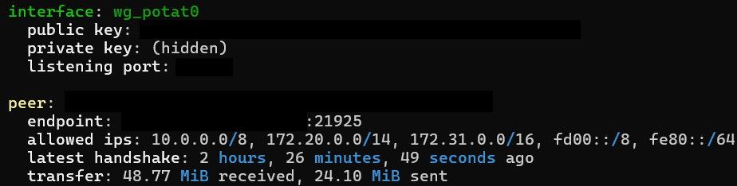

## 前言

DN42 是一個大型、去中心化的 VPN 網路，使用到了如 BGP, whois database, DNS 等等的網路技術，你可以在上面模擬一個真實的網路環境。

:::warning
由於使用 DN42 的門檻較高，因為在 DN42 中你所扮演的角色就是 ISP，你需要註冊 ASN, IPv4 及 IPv6 的位址池，並使用 BGP 在自己的伺服器廣播它們。你還要跟其他用戶進行 Peer，才能進一步完成 DN42 網路。

簡而言之，DN42：

- 不適於想要隱藏流量，想在上面大量消耗流量的人
- 適合想要研究網路技術，練習路由器、伺服器等網路設備配置的人，甚至後續在真實網路上建立 AS 的人 
:::


其實這篇文章我很早就想寫了，不過最近在期中考，還有一堆報告要做就一直拖到現在了 (去年 11/29 就註冊了)。

## 能力需求

1. 一定的英文能力 (查看官方文檔)
   
2. 一個 Linux 環境 (雙系統 / 虛擬機 / VPS)
   
3. 知道如何使用 Linux 指令，編輯器等
   
4. Git 的基本使用
   
5. 一定程度的網路知識

## 開始註冊

:::warning
此處的教學可能會因時間有所改變，最好還是參考[官方 Wiki](https://dn42.dev/Home)
:::

1. 首先先去 https://git.dn42.dev/ 註冊帳號
   
2. 到 [dn42/registry](https://git.dn42.dev/dn42/registry) Fork 該儲存庫到自己的帳戶
   
3. 將 Fork 到你帳戶的儲存庫 Clone 下來
   
4. 進入你 Clone 下來的儲存庫，在裡面創建以下文件：

   1. 在 `data/mntner/` 中創建一個名叫 `[暱稱]-MNT` 的檔案
   
   ```
   mntner:             [暱稱]-MNT
   admin-c:            [暱稱]-DN42
   tech-c:             [暱稱]-DN42
   mnt-by:             [暱稱]-MNT
   auth:               ssh-ed25519 0123456789ABCDEF0123456789ABCDEF01234567
   source:             DN42
   ```
   注意，中間的間隔不要刪減，這是 DN42 的規定  
   auth 是驗證方式，若要使用需在 gitea 中新增金鑰，支援方式有 SSH 或 GPG

   2. 在 `data/person/` 中創建一個名叫 `[暱稱]-DN42` 的檔案
   
   ```
   person:             [你的名字]
   e-mail:             example@example.com
   nic-hdl:            [暱稱]-DN42
   mnt-by:             [暱稱]-MNT
   source:             DN42
   ```

   3. 註冊 AS 號碼，在 `data/aut-num/` 中創建一個名叫 `AS424242XXXX` 的檔案，`AS424242XXXX` 為你的 AS 號碼  
   你可以在 [dn42regsrv](https://explorer.burble.com/free#/asn) 挑選喜歡的號碼

   ```
   aut-num:            AS424242XXXX
   as-name:            AS-[暱稱]-DN42
   admin-c:            [暱稱]-DN42
   tech-c:             [暱稱]-DN42
   mnt-by:             [暱稱]-MNT
   source:             DN42
   ```

   4. 註冊網路區段

      - IPv6:  
      你可以在 [dn42regsrv](https://explorer.burble.com/free#/6) 挑選喜歡的號碼，然後在 `data/inet6num/` 中創建一個你挑選的網段的檔案，(e.g `fd63:c95c:25a0::_48`)

      ```
      inet6num:           fd63:c95c:25a0:0000:0000:0000:0000:0000 - fd63:c95c:25a0:ffff:ffff:ffff:ffff:ffff
      cidr:               fd63:c95c:25a0::/48
      netname:            [暱稱]-NETWORK
      descr:              Network of [暱稱]
      country:            TW
      admin-c:            [暱稱]-DN42
      tech-c:             [暱稱]-DN42
      mnt-by:             [暱稱]-MNT
      status:             ASSIGNED
      source:             DN42
      ```

      - IPv4 (舊版):  
      你可以在 [dn42regsrv](https://explorer.burble.com/free#/4) 挑選喜歡的號碼，然後在 `data/inetnum/` 中創建一個你挑選的網段的檔案，(e.g `172.22.125.0_27`)

      ```
      inetnum:            172.22.125.0 - 172.22.125.31
      cidr:               172.22.125.0/27
      netname:            [暱稱]-NETWORK
      descr:              Network of [暱稱]
      country:            TW
      admin-c:            [暱稱]-DN42
      tech-c:             [暱稱]-DN42
      mnt-by:             [暱稱]-MNT
      status:             ASSIGNED
      source:             DN42
      ```
      

   6. 創建 route 對象

      - IPv6:  
      在 `data/route6/` 中創建一個你挑選的網段的檔案，(e.g `fd63:c95c:25a0::_48`)

      ```
      route6:             fd63:c95c:25a0::/48
      origin:             AS424242XXXX
      max-length:         48
      mnt-by:             [暱稱]-MNT
      source:             DN42
      ```

      - IPv4:  
      在 `data/route/` 中創建一個你挑選的網段的檔案，(e.g `172.22.125.0_27`)

      ```
      route:              172.22.125.0/27
      origin:             AS424242XXXX
      max-length:         27
      mnt-by:             [暱稱]-MNT
      source:             DN42
      ```

5. 推送到儲存庫，你已經創建完所需的檔案了，回到儲存庫的根目錄，接著進行以下步驟：
   
   1. 執行這三個指令以驗證你的更改：
   
      - `./fmt-my-stuff [暱稱]-MNT`
      - `./check-my-stuff [暱稱]-MNT`
      - `./check-pol origin/master [暱稱]-MNT`
   
   2. 設定 Git 簽署金鑰，這邊示範的是 SSH，有需要可以參考 [Github](https://docs.github.com/en/authentication/managing-commit-signature-verification/telling-git-about-your-signing-key)：
      
      - `git config --global gpg.format ssh`
      - `git config --global user.signingkey /PATH/TO/.SSH/KEY.PUB`
   
   3. 執行 `git add .` 及 `git commit -S -m "commit message"`，`commit message` 視情況修改，由於你是第一次註冊，你可以打 `Join DN42` 之類的
   
   4. 執行 `./squash-my-commits -S --push`，這個腳本將會把你目前的儲存庫與上游進行同步並推送

6. 最後到 [dn42/registry](https://git.dn42.dev/dn42/registry) 發起 Pull Request，記得用英文，然後就是等管理員合併你的 Pull Request

## 尋找 Peers

你可以使用 [DN42 PingFinder](https://dn42.us/peers)，測試與其他使用者的延遲，根據他們留下的資訊去聯繫他們。

## 重要系統配置

:::warning
注意! 一定要關閉內核 `rp_filter` 功能，若非設定為 0，封包會被丟棄
:::

執行下方指令，開啟封包轉送功能及關閉 `rp_filter`

```
echo "net.ipv4.ip_forward=1" >> /etc/sysctl.conf
echo "net.ipv6.conf.default.forwarding=1" >> /etc/sysctl.conf
echo "net.ipv6.conf.all.forwarding=1" >> /etc/sysctl.conf
echo "net.ipv4.conf.default.rp_filter=0" >> /etc/sysctl.conf
echo "net.ipv4.conf.all.rp_filter=0" >> /etc/sysctl.conf
sysctl -p
```

防火牆請自行配置，不要使用 UFW 等幫助你簡單設定 iptables 的軟體，最好是自己手動配置 iptables。

## 建立隧道

:::warning
注意! 接下來的環境為開啟 `MP-BGP` 及 `extended next hops` 的情況，若有其他需求請參考[官方 Wiki](https://dn42.dev/Home)
:::

在 DN42 上，幾乎每個 Peering 都是建立在隧道上 (VPN)，推薦的有 Wireguard 及 OpenVPN，我個人偏好使用 Wireguard，本篇文章也是以 Wireguard 來撰寫。

首先安裝 Wireguard，輸入這串指令安裝 Wireguard

```
apt install wireguard -y
```

接著進入 `/etc/wireguard`，執行這串指令創建公鑰及私鑰

```
wg genkey | tee privatekey | wg pubkey > publickey
```

創建一個名叫 `wg_[PEER_NAME].conf` 的檔案，其實前面不用加 wg，名稱可以自訂，不過這樣會比較好分辨隧道

```
[Interface]
# 你的 Wireguard 私鑰
PrivateKey = ABCDEFABCDEFABCDEFABCDEFABCDEFABCDEFABCDEFA=
# 你監聽的連接埠，一般是 Peer 的 ASN 後五碼
ListenPort = 21816
# 新增 Link-Local IPv6 (如 fe80::1111)
PostUp = ip addr add <Link-Local>/64 dev %i
Table = off

[Peer]
# 你的 Peer 的 Wireguard 公鑰
PublicKey = ABCDEFABCDEFABCDEFABCDEFABCDEFABCDEFABCDEFA=
# 你的 Peer 的伺服器位址及連接埠
Endpoint = <Peer 的公網位址>:<Peer 的連接埠>
AllowedIPs = 10.0.0.0/8, 172.20.0.0/14, 172.31.0.0/16, fd00::/8, fe80::/64
```

之後創建一個 dummy 網卡把你 DN42 的 IP 綁上去，不然路由可能無法寫到內核

```
ip link add dn42_dummy type dummy
ip addr add <你 DN42 的 IPv4 位址的第一個 IP>/32 dev dn42_dummy
ip addr add <你 DN42 的 IPv6 位址的第一個 IP>/128 dev dn42_dummy
ip link set dn42_dummy up
```

接著輸入 `wg-quick up wg_[PEER_NAME]` 啟動隧道

輸入 `systemctl enable wg-quick@wg_[PEER_NAME]` 讓隧道在開機後能自行啟動

輸入 `wg` 確認隧道狀態，應該會像下圖



接著可以 ping 看看對面

```
ping fe80::XXXX%wg_[PEER_NAME]
```

由於 dummy 網卡重啟後就會消失，因此需要寫入配置文件，Ubuntu 可以使用 netplan

在 `/etc/netplan` 創建一個名叫 `51-dn42-dummy.yaml` 的檔案，前面的數字依該目錄檔案而決定，如果有其他檔案記得數字一定要大於該檔案的數字

```
network:
  version: 2
  dummy-devices:
    dn42_dummy:
      addresses:
        - <你 DN42 的 IPv4 位址的第一個 IP>/32
        - <你 DN42 的 IPv6 位址的第一個 IP>/128
```

## 建立 BGP 會話

我使用的是 BIRD，配置過程複雜，像是在寫程式，不習慣的人最好還是用 FRRouting 之類的路由程式

請先到 [DN42 Wiki 上查看 Bird2 的配置教學](https://dn42.dev/howto/Bird2)

記得修改前面的區塊成自己的

```
################################################
#               Variable header                #
################################################

define OWNAS =  <你的 ASN>;
define OWNIP =  <你 DN42 的 IPv4 位址的第一個 IP>;
define OWNIPv6 = <你 DN42 的 IPv6 位址的第一個 IP>;
define OWNNET = <你 DN42 的 IPv4 位址區段>/27;
define OWNNETv6 = <你 DN42 的 IPv6 位址區段>/48;
define OWNNETSET = [<你 DN42 的 IPv4 位址區段>/27+];
define OWNNETSETv6 = [<你 DN42 的 IPv6 位址區段>/48+];

################################################
#                 Header end                   #
################################################
```

因為我們要使用 extended next hops，因此還需新增一段內容

```
template bgp dnpeers {
    local as OWNAS;
    path metric 1;

    ipv4 {
        # 開啟 extended next hops 功能
        extended next hop on;

        import filter {
          if is_valid_network() && !is_self_net() then {
            if (roa_check(dn42_roa, net, bgp_path.last) != ROA_VALID) then {
              # Reject when unknown or invalid according to ROA
              print "[dn42] ROA check failed for ", net, " ASN ", bgp_path.last;
              reject;
            } else accept;
          } else reject;
        };

        export filter { if is_valid_network() && source ~ [RTS_STATIC, RTS_BGP] then accept; else reject; };
        import limit 9000 action block;
    };

    ipv6 {
        import filter {
          if is_valid_network_v6() && !is_self_net_v6() then {
            if (roa_check(dn42_roa_v6, net, bgp_path.last) != ROA_VALID) then {
              # Reject when unknown or invalid according to ROA
              print "[dn42] ROA check failed for ", net, " ASN ", bgp_path.last;
              reject;
            } else accept;
          } else reject;
        };
        export filter { if is_valid_network_v6() && source ~ [RTS_STATIC, RTS_BGP] then accept; else reject; };
        import limit 9000 action block;
    };
}
```

ROA 的配置也請參考[官方 Wiki](https://dn42.dev/howto/Bird2) 的配置

接著在 `/etc/bird/` 中創建名叫 `peers` 的資料夾，在裡面創建名叫 `dn42_[PEER_NAME].conf` 的檔案

```
protocol bgp dn42_[PEER_NAME]_v6 from dnpeers {
        # 設置對面的 Link-Local IPv6，隧道介面及 ASN
        neighbor fe80::XXXX % '<Wireguard 隧道介面>' as <對方的 ASN>;
        direct;
}
```

之後輸入 `birdc c` 或 `systemctl restart bird` 重新加載配置

輸入 `birdc s p` 可查看連線狀況，如果是 `Established` 就代表 Peer 成功了


之後就可以 Ping 一下 DN42 裡的服務，如 DNS (172.20.0.53)

## Peer with me!

我的 DN42 資訊：

- ASN: `AS4242421925`
- IPv4 prefix: `172.21.75.128/27`
- IPv6 prefix: `fd1c:4efc:f725::/48`

聯絡方式：

- Email: [bobchen3310@bob0623.net](mailto:bobchen3310@bob0623.net)

## 結語

其實可以做的事還很多，目前這樣就只是最基礎的，接下來可以做的還有深入了解 Bird2 的配置，在 DN42 中架設服務等等的，之後我會再寫一篇文章來記錄。

目前我正在研究 AutoPeer 服務，想跟我 Peer 的敬請期待

## 參考資料

- [DN42 Wiki](https://dn42.dev/Home)
- [BIRD 与 BGP 的新手开场 - 海上的宫殿](https://soha.moe/post/bird-bgp-kickstart.html)