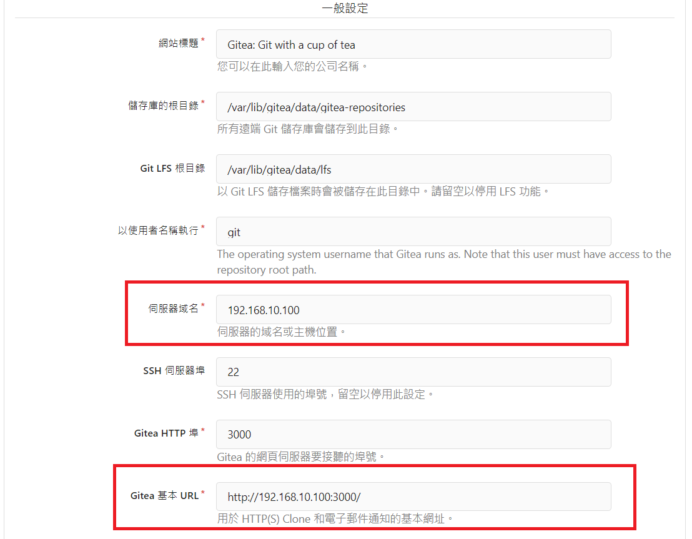

## 前言

:::warning
注意! 此教學可能會因為官方更新而有所影響，最好還是參考[**官方文檔**](https://docs.gitea.com/)
:::

Gitea 是一套極易架設的 Git 服務，前幾天在研究 DN42 時意外發現了這個平台，有著跟 Github 類似的風格，以及中文化 (少部分翻譯未完善)，而且翻閱了官方文檔後發現架設方法相當的簡單，花了點時間研究後就架起來了

## 安裝方式

Gitea 官方提供了很多的安裝方式，如下：

- [From Binary](https://docs.gitea.com/installation/install-from-binary)
- [From Package](https://docs.gitea.com/installation/install-from-package)
- [From Source](https://docs.gitea.com/installation/install-from-source)
- [From Docker](https://docs.gitea.com/installation/install-with-docker) 

我個人偏好使用 Binary 的方式安裝，當然並不是最快的，只是我懶得安裝 Docker :)

### 開始

首先要先下載 Binary，並且給予執行的權限

```bash
wget -O gitea https://dl.gitea.com/gitea/1.21.1/gitea-1.21.1-linux-amd64
chmod +x gitea
```

:::warning
注意! 上述指令僅適用於x86_64架構的機器，如要其他版本至此[**下載**](https://github.com/go-gitea/gitea/releases/latest)
:::

接著安裝 Git (如果未安裝)，官方要求 Git 版本需 >= 2.0

```bash
apt install git -y
```

然後建立使用者來運行 Gitea (e.g `git`)

```bash
adduser \
   --system \
   --shell /bin/bash \
   --gecos 'Git Version Control' \
   --group \
   --disabled-password \
   --home /home/git \
   git
```

建立關聯資料夾

```bash
mkdir -p /var/lib/gitea/{custom,data,log}
chown -R git:git /var/lib/gitea/
chmod -R 750 /var/lib/gitea/
mkdir /etc/gitea
chown root:git /etc/gitea
chmod 770 /etc/gitea
```

然後把 gitea 丟到 Global Location

```bash
cp gitea /usr/local/bin/gitea
```

接著設定服務讓 Gitea 運作，詳細設定請參閱[此處](https://github.com/go-gitea/gitea/blob/release/v1.21/contrib/systemd/gitea.service)，我個人是直接複製貼上，檔案要放在 `/etc/systemd/system/gitea.service`

:::warning
注意! 似乎是設定的問題，建議將 gitea.service 中的 Service 區塊內的 Type 改為 simple
:::

然後讓 Gitea 服務啟動

```bash
systemctl daemon-reload
systemctl enable gitea
systemctl start gitea
```

### 設定

接著瀏覽器打開，瀏覽 `http://ip:3000` 進行設定

設定想要用的資料庫，我是選擇 SQLite


設定域名及 URL，改為你要用的 (e.g `example.com`)



最後選擇管理員帳號，創建一個管理員帳號


然後點擊安裝後等待一小段時間就可以使用 Gitea 了 :)


之後可以再設定 Nginx 進行反向代理以及 HTTPS 的功能

## 參考連結

- [Documentation | Gitea](https://docs.gitea.com/)